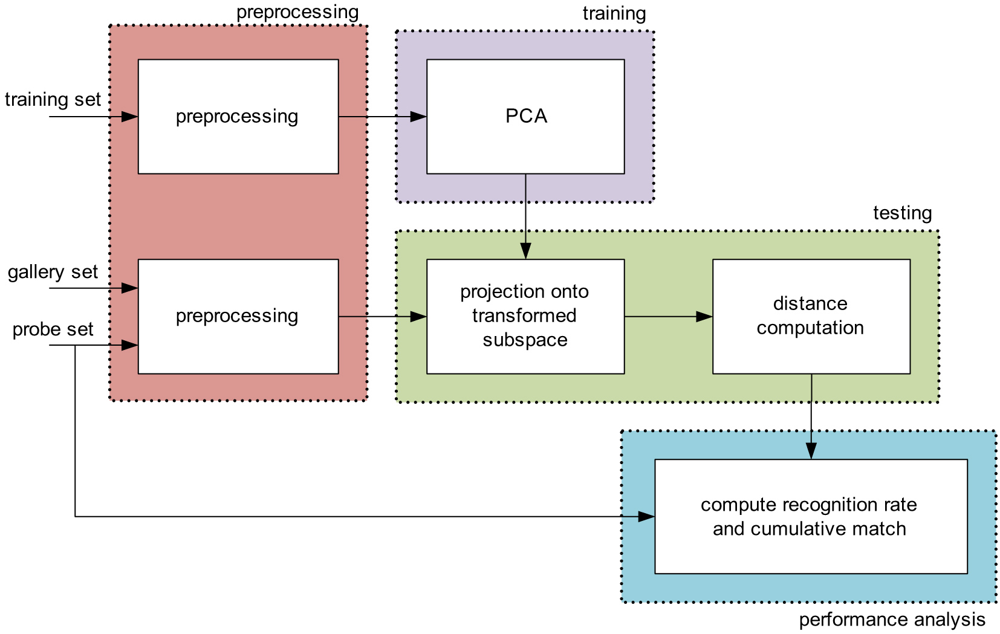
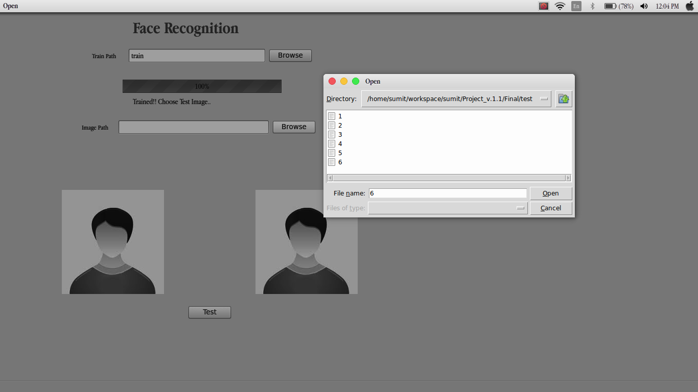

# Face Recognition System.

## Description
-------------------------------------
A standalone face recognition application implemented using [Principal components analysis(PCA)](http://www.cs.otago.ac.nz/cosc453/student_tutorials/principal_components.pdf)

technologies used: python programming language,PyQt(GUI).
python packages required : [PyQt4](https://pypi.python.org/pypi/PyQt4),[TkInter](https://wiki.python.org/moin/TkInter)

#### Application architecture:

ScreenShot:

